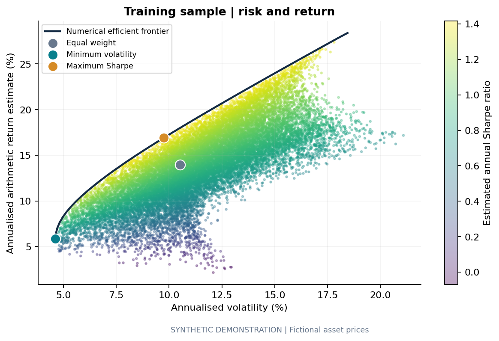
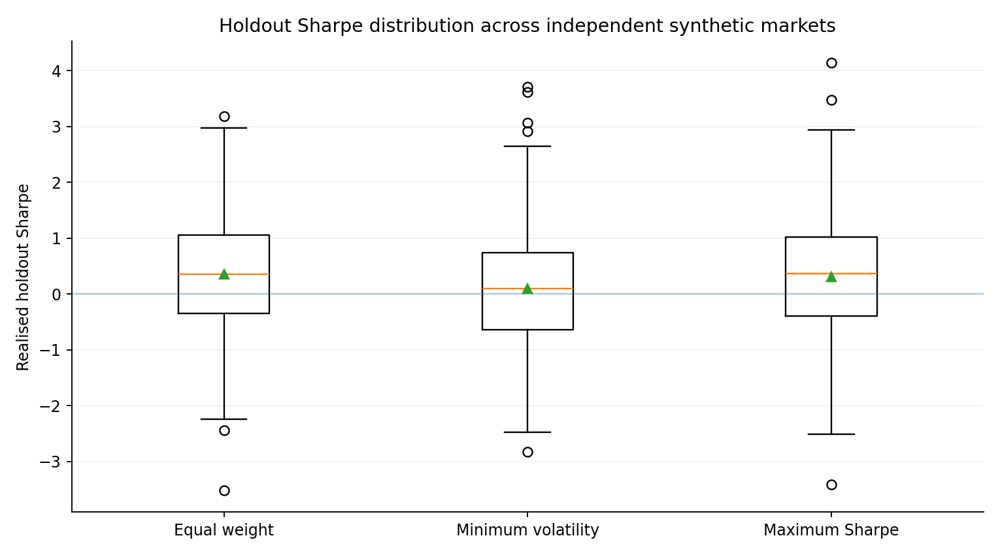
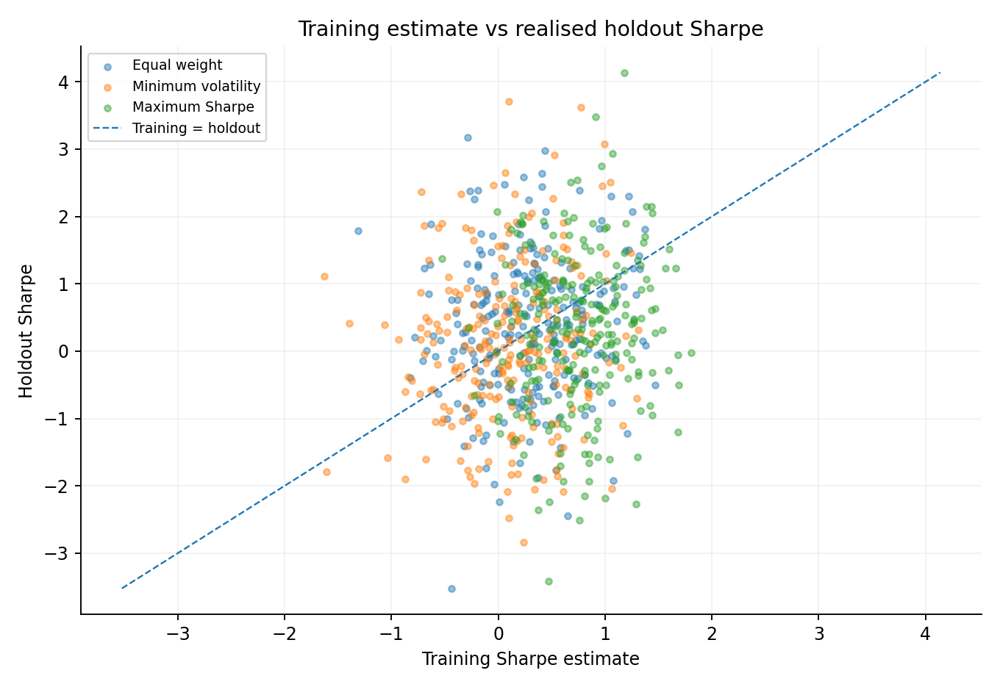

# Portfolio Risk Lab v2

[](https://github.com/diogoalvess77/portfolio-risk-lab/actions/workflows/tests.yml)

**Portfolio optimisation, out-of-sample evaluation and repeated robustness testing in Python.**



> **Data honesty:** every committed chart and result in this repository uses **synthetic demonstration data**. The assets are fictional. Nothing here is historical performance, a forecast or investment advice.

## Why this project exists

Portfolio optimisation can look excellent in-sample and disappoint once the same weights are taken out of sample. This project tests that problem explicitly.

The baseline workflow fits three long-only portfolios on a training period and evaluates the fixed allocations on a later holdout period:

- Equal weight
- Minimum volatility
- Maximum estimated Sharpe

Version 2 adds a second research layer: the full fit → holdout process is repeated across **250 independent synthetic market paths** and three volatility regimes. That makes the conclusion much less dependent on one lucky or unlucky random seed.

## What the project does

### Baseline analysis

- Validates a price CSV instead of silently filling bad data.
- Splits returns chronologically: 80% training / 20% holdout by default.
- Samples **20,000 fully invested long-only allocations** with a Dirichlet distribution.
- Computes a **40-point efficient frontier** with constrained SLSQP optimisation.
- Finds equal-weight, minimum-volatility and maximum-Sharpe allocations.
- Evaluates fixed initial weights in the holdout with buy-and-hold drift.
- Reports total return, CAGR, annualised volatility, Sharpe, maximum drawdown, empirical 95% VaR and expected shortfall.
- Produces five charts, CSV outputs, hashes, run metadata and a standalone HTML report.

### Robustness layer

- Repeats the full training/holdout experiment across **250 independent synthetic markets**.
- Rotates through low-, base- and high-volatility synthetic regimes.
- Records training Sharpe and realised holdout Sharpe for every strategy and path.
- Calculates strategy holdout win rates.
- Measures the average train-to-holdout Sharpe gap.
- Measures allocation-weight stability across experiments.
- Produces four additional robustness charts plus raw experiment CSVs and an HTML report.

### Sensitivity layer

- Re-runs one reproducible synthetic path under 70/30, 80/20 and 90/10 train/holdout splits.
- Tests annual risk-free assumptions of 0%, 3% and 5%.
- Exports a matrix of realised holdout Sharpe ratios across assumptions.

## Example baseline result

The committed baseline uses 5 fictional assets, 1,261 prices, 1,008 training returns and 252 holdout returns.

| Holdout result | Equal weight | Minimum volatility | Maximum Sharpe |
|---|---:|---:|---:|
| Total return | 16.67% | 14.48% | 14.47% |
| Annualised volatility | 10.40% | 4.93% | 10.60% |
| Sharpe ratio | 1.25 | 2.17 | 1.05 |
| Maximum drawdown | -6.48% | -1.89% | -5.27% |

The maximum-Sharpe portfolio was selected using training estimates only, yet it did not have the best realised Sharpe in the holdout. One path cannot establish a general result, which is why v2 adds repeated-market robustness testing.

## Robustness result — 250 synthetic markets



Across the committed 250-path experiment:

| Strategy | Mean holdout Sharpe | Mean training Sharpe | Mean holdout-training gap | Holdout Sharpe win rate |
|---|---:|---:|---:|---:|
| Equal weight | 0.35 | 0.28 | +0.07 | 38.8% |
| Minimum volatility | 0.10 | 0.09 | +0.01 | 33.2% |
| Maximum Sharpe | 0.30 | 0.75 | -0.45 | 28.0% |

These figures describe this **synthetic design only**. The important research signal is the gap between a strong training estimate and weaker average out-of-sample performance for the optimised Sharpe portfolio.



## Run locally on macOS

Requires Python 3.10 or later.

```bash
cd portfolio-risk-lab
python3 -m venv .venv
source .venv/bin/activate
python -m pip install --upgrade pip
python -m pip install -e ".[dev]"
```

Run the baseline:

```bash
python run_demo.py
open outputs/demo/report.html
```

Run the full robustness experiment:

```bash
python run_robustness.py --experiments 250
open outputs/robustness/robustness_report.html
```

Run the sensitivity grid:

```bash
python run_sensitivity.py
```

Run the tests:

```bash
python -m pytest -q
```

Expected result for this version:

```text
22 passed
```

A 250-path robustness run took roughly 15 seconds in the environment used to build this release; your Mac may be faster or slower.

## Installed command-line tools

After `pip install -e .`, the same workflows are available as:

```bash
portfolio-risk-lab
portfolio-risk-lab-robustness --experiments 250
portfolio-risk-lab-sensitivity
```

## Use your own authorised price data

```bash
portfolio-risk-lab --prices data/private/prices.csv --output outputs/my-analysis
```

The CSV contract is documented in [`data/README.md`](data/README.md). The project does not download or redistribute market data.

## Change assumptions

```bash
portfolio-risk-lab \
  --portfolios 50000 \
  --seed 12 \
  --train-fraction 0.8 \
  --risk-free-rate 0.03 \
  --output outputs/experiment
```

The 3% risk-free input is an illustrative assumption, not a live market yield.

## Repository structure

```text
src/portfolio_risk_lab/
  core.py              # validation, estimation, optimisation, execution, risk metrics
  demo.py              # reproducible synthetic market generator
  reporting.py         # baseline charts, CSVs and HTML report
  robustness.py        # repeated-market robustness engine + reporting
  robustness_cli.py    # robustness command-line interface
  sensitivity.py       # assumption sensitivity grid
  sensitivity_cli.py   # sensitivity command-line interface
  cli.py               # baseline command-line workflow

tests/test_core.py     # 22 numerical, validation and robustness tests
examples/demo/         # committed baseline outputs
examples/robustness/   # committed 250-path robustness outputs
examples/sensitivity/  # committed sensitivity outputs
docs/                  # methodology, code walkthrough and publishing guides
```

## Tests and reproducibility

The test suite checks, among other things:

- analytical minimum-variance behaviour;
- dense-grid maximum-Sharpe comparison;
- feasible and reproducible random weights;
- invalid price and weight rejection;
- chronological split correctness;
- isolation of training estimates from holdout changes;
- configurable efficient-frontier size;
- deterministic synthetic path generation;
- repeated robustness output structure;
- exactly one holdout Sharpe winner per experiment;
- reproducibility of repeated robustness runs.

GitHub Actions runs the test suite plus baseline, robustness and sensitivity smoke runs on pushes and pull requests.

## Important limitations

- The committed data are synthetic and use a simplified geometric-Brownian generator.
- Real markets can contain jumps, fat tails, time-varying volatility, liquidity constraints and structural breaks not represented here.
- Expected returns are especially noisy; optimised allocations can be unstable.
- No transaction costs, taxes, turnover penalty, leverage or short selling are included.
- Empirical VaR and expected shortfall are descriptive sample statistics, not guaranteed loss limits.
- Repeated synthetic experiments improve robustness **within the chosen model**, not external validity to real markets.

## Documentation

- [`docs/METHODOLOGY.md`](docs/METHODOLOGY.md) — equations and modelling choices
- [`docs/ROBUSTNESS.md`](docs/ROBUSTNESS.md) — v2 repeated-market design and interpretation
- [`docs/CODE_WALKTHROUGH.md`](docs/CODE_WALKTHROUGH.md) — implementation walkthrough
- [`docs/MAC_QUICKSTART.md`](docs/MAC_QUICKSTART.md) — exact macOS setup commands
- [`docs/PUBLISHING_GUIDE.md`](docs/PUBLISHING_GUIDE.md) — GitHub and LinkedIn publication checklist

## Disclosure

This is an educational project built with AI assistance. The methodology, code, tests, generated outputs and documentation are included so the work can be inspected and reproduced.
